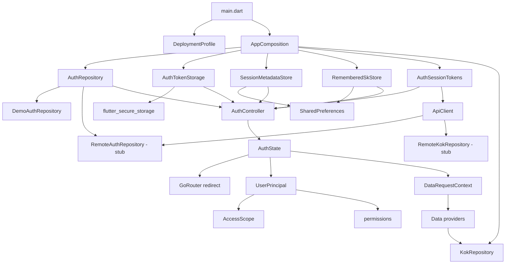
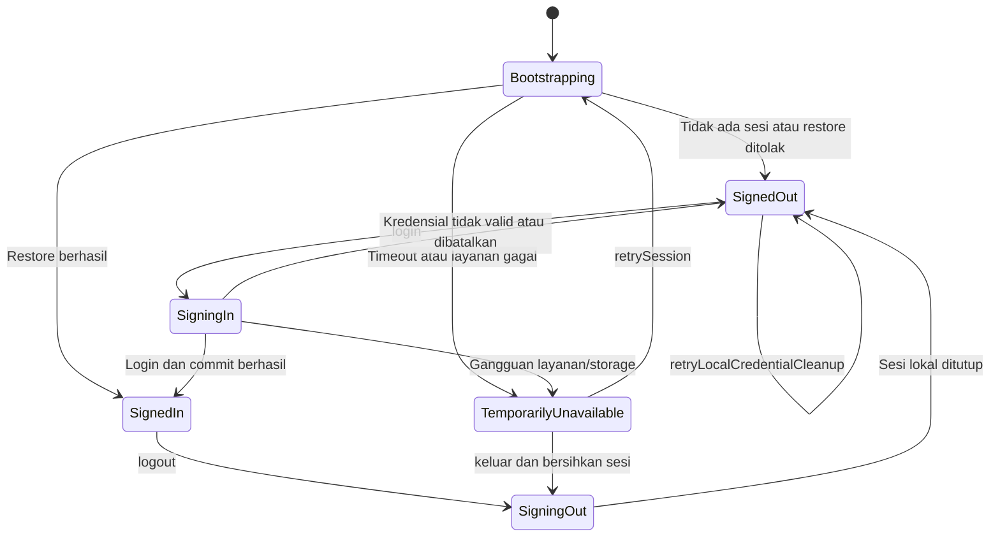
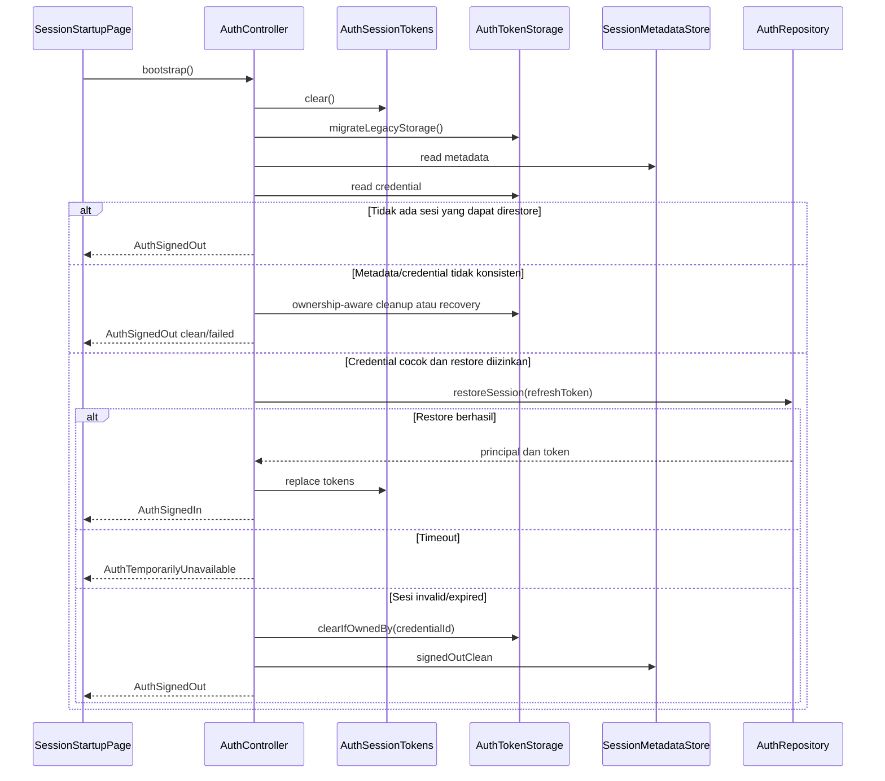
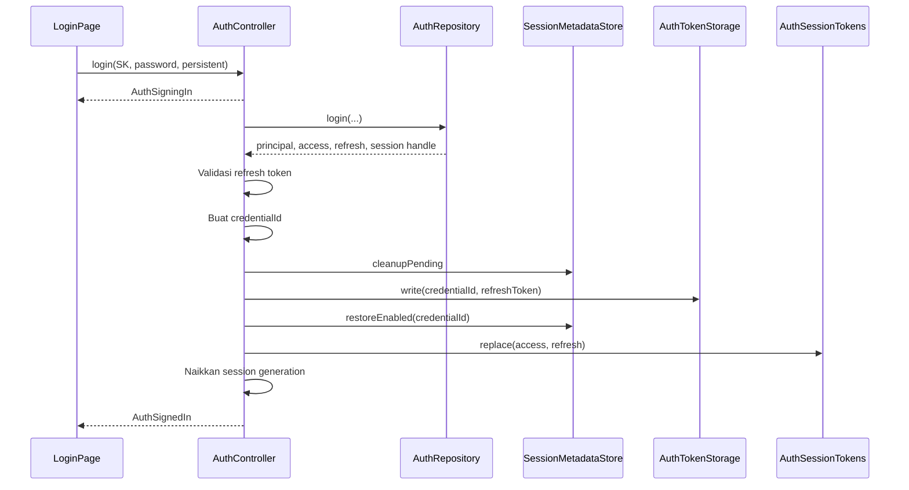
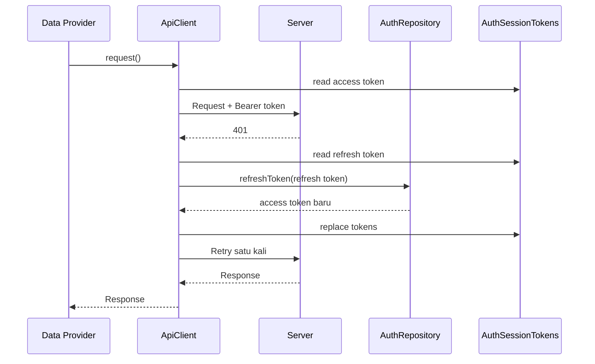
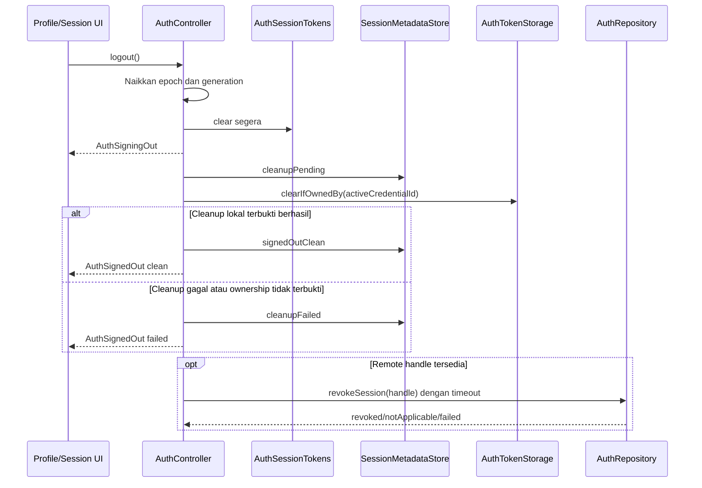

# Arsitektur Autentikasi Aplikasi KOK Saat Ini

> **Catatan 19 September 2026:** ini baseline implementasi sebelum integrasi. [Kontrak resmi SICABOR](../api/api-kok-sicabor.md) kini tersedia: username, satu token 24 jam, tanpa refresh. Pernyataan bahwa kontrak belum tersedia dan rekomendasi refresh di bawah adalah konteks pembacaan 14 September, bukan arsitektur target. Lihat [status proyek](../project-status.md).

> **Status dokumen:** baseline arsitektur _as-is_
> **Tanggal pembacaan kode:** 14 September 2026
> **Versi aplikasi:** `0.1.0+1`
> **Ruang lingkup:** autentikasi, lifecycle sesi, penyimpanan token, route guard, otorisasi, integrasi HTTP, isolasi data antarsesi, konfigurasi deployment, dan pengujian terkait.

## 1. Ringkasan eksekutif

Aplikasi telah memiliki arsitektur autentikasi sisi klien yang cukup terstruktur dan defensif untuk mode demo. Autentikasi tidak lagi berupa boolean sederhana. Kondisi sesi dikelola sebagai state machine melalui Riverpod, seluruh route dijaga secara terpusat oleh `GoRouter`, refresh token persisten disimpan melalui `flutter_secure_storage`, dan data dibatasi oleh konteks pengguna, scope, serta generasi sesi.

Kondisi utamanya adalah:

| Area | Kondisi saat ini |
| --- | --- |
| Login demo | **Berfungsi** untuk tiga akun yang didefinisikan di source code |
| Restore sesi demo | **Berfungsi** jika pengguna memilih sesi persisten |
| Logout lokal | **Berfungsi**, termasuk penghapusan token memori dan credential persisten |
| Route guard | **Berfungsi** berdasarkan state autentikasi |
| Access token HTTP | **Sudah didukung** melalui header Bearer |
| Refresh setelah HTTP 401 | **Sudah didukung** dengan mekanisme single-flight dan satu kali retry |
| Isolasi data antarsesi | **Sudah didukung** dengan user, scope, generation, cancellation, dan stale-response guard |
| Auth remote/production | **Belum diimplementasikan**; seluruh operasi `RemoteAuthRepository` masih melempar `UnimplementedError` |
| Data remote/production | **Belum diimplementasikan**; `RemoteKokRepository` masih berupa stub |
| Otorisasi | **Parsial**; scope digunakan pada beberapa request, tetapi sebagian besar permission belum ditegakkan |
| Backend sebagai security authority | **Belum dapat diverifikasi** karena kontrak dan implementasi backend tidak tersedia |

Kesimpulannya, fondasi lifecycle autentikasi lokal telah dibuat dengan baik, tetapi aplikasi **belum siap melakukan autentikasi produksi**. Hambatan utamanya bukan UI login, melainkan belum adanya adapter backend nyata dan belum tuntasnya lifecycle refresh serta enforcement otorisasi.

## 2. Cara membaca dokumen

Dokumen ini menjelaskan kode yang benar-benar ada pada saat pembacaan, bukan arsitektur target.

Label yang digunakan:

- **Diimplementasikan**: jalur kode tersedia dan memiliki pengujian terkait.
- **Parsial**: struktur dasar tersedia, tetapi enforcement atau integrasinya belum lengkap.
- **Belum diimplementasikan**: kontrak tersedia, tetapi adapter nyata masih berupa stub.
- **Belum dapat diverifikasi**: membutuhkan backend, perangkat, konfigurasi deployment, atau kebijakan di luar repository.

Dokumen audit dan rencana lama di `docs/audit/auth/` serta `docs/superpowers/` tetap berguna sebagai riwayat keputusan, tetapi sebagian menggambarkan versi arsitektur sebelum state machine saat ini dibuat. Dokumen ini menjadi acuan kondisi implementasi terbaru yang terbaca dari source code.

## 3. Stack dan dependensi auth

| Teknologi | Peran |
| --- | --- |
| Flutter | Runtime aplikasi |
| `flutter_riverpod` | Dependency injection dan state autentikasi |
| `go_router` | Navigasi dan redirect berdasarkan state auth |
| `dio` | HTTP client, Bearer token, mapping error, dan retry setelah refresh |
| `flutter_secure_storage` | Penyimpanan refresh token persisten |
| `shared_preferences` | Metadata transaksi sesi dan nomor SK yang diingat |

Entrypoint `lib/main.dart` melakukan inisialisasi berikut sebelum aplikasi dijalankan:

1. Membaca `DeploymentProfile` dari compile-time environment.
2. Membuka `SharedPreferences`.
3. Membuat `FlutterSecureStorage`.
4. Membentuk dependency graph melalui `AppComposition.fromProfile()`.
5. Menginjeksi composition ke `ProviderScope`.

Konfigurasi secure storage yang digunakan:

- Android: `AndroidOptions(encryptedSharedPreferences: true)`;
- iOS: `IOSOptions(accessibility: KeychainAccessibility.first_unlock)`.

## 4. Gambaran arsitektur



### 4.1 Batas tanggung jawab lapisan

| Lapisan | Tanggung jawab | File utama |
| --- | --- | --- |
| Composition/config | Memilih implementasi demo atau remote, membuat storage dan HTTP client | `lib/core/composition/app_composition.dart`, `lib/core/config/deployment_profile.dart` |
| Domain auth | Mendefinisikan state, principal, scope, permission, dan failure | `lib/core/auth/domain/` |
| Data auth | Kontrak login/restore/refresh/revoke serta persistence sesi | `lib/core/auth/data/` |
| Presentation auth | Mengorkestrasi lifecycle sesi dan halaman transisi auth | `lib/core/auth/presentation/` |
| Routing | Menentukan route yang boleh tampil untuk setiap state | `lib/app.dart` |
| Network | Menambahkan Bearer token, refresh pada 401, dan mapping error | `lib/core/network/` |
| Session-scoped data | Mengikat request data pada user, scope, dan generation aktif | `lib/data/providers/` |
| Feature UI | Form login, aksi logout, dan sebagian pengecekan permission | `lib/features/` |

## 5. Dependency composition dan mode runtime

### 5.1 Konfigurasi environment

`DeploymentProfile.fromEnvironment()` membaca nilai compile-time berikut:

| Define | Default | Nilai yang didukung |
| --- | --- | --- |
| `APP_ENV` | `demo` | `demo`, `staging`, `production` |
| `AUTH_MODE` | `demo` | `demo`, `remote` |
| `DATA_MODE` | `demo` | `demo`, `remote` |
| `API_BASE_URL` | kosong | URL absolut `http` atau `https` untuk mode remote |
| `API_CONNECT_TIMEOUT_MS` | 10.000 ms | Bilangan positif |
| `API_RECEIVE_TIMEOUT_MS` | 30.000 ms | Bilangan positif |

Aturan validasi saat ini:

- `demo` hanya menerima auth demo dan data demo;
- `staging` menolak kombinasi auth demo dengan data remote;
- `production` wajib memakai auth remote dan data remote;
- mode remote wajib memiliki URL absolut dengan skema `http` atau `https`;
- timeout harus lebih besar dari nol.

### 5.2 Pemilihan dependency

`AppComposition.fromProfile()` memilih implementasi berikut:

| Mode | Auth repository | Data repository | HTTP client |
| --- | --- | --- | --- |
| Demo | `DemoAuthRepository` | `DemoKokRepository` | Tidak dibuat |
| Remote | `RemoteAuthRepository` | `RemoteKokRepository` jika data remote | `ApiClient` |

Composition bersifat fail-closed pada dua titik:

1. Profile production tidak boleh memakai repository demo.
2. `appCompositionProvider` melempar `StateError` jika startup lupa menginjeksi composition.

Namun, profile production yang valid secara konfigurasi **belum berarti operasional**. `RemoteAuthRepository` dan `RemoteKokRepository` masih sengaja gagal karena endpoint SICABOR belum dikonfigurasi.

## 6. Kontrak autentikasi

`AuthRepository` mendefinisikan empat operasi:

```dart
Future<AuthResult> login({
  required String skNumber,
  required String password,
  required bool staySignedIn,
});

Future<AuthResult> restoreSession(String refreshToken);
Future<AuthResult> refreshToken(String refreshToken);
Future<RemoteRevocationResult> revokeSession(RemoteSessionHandle session);
```

`AuthResult` dapat membawa:

- `UserPrincipal`;
- access token;
- refresh token;
- remote session handle untuk revocation;
- typed `AuthFailure` jika gagal.

`RemoteSessionHandle.toString()` dan `StoredCredential.toString()` melakukan redaction agar token tidak langsung tercetak sebagai string biasa.

### 6.1 Implementasi demo

`DemoAuthRepository` memiliki tiga principal:

| Nomor SK | Peran | Scope | Permission |
| --- | --- | --- | --- |
| `DEMO-001` | Koordinator Kecamatan | Kecamatan Garut Kota | `sports:read`, `clubs:read`, `members:read`, `reports:export` |
| `DEMO-002` | Koordinator Kecamatan | Kecamatan Tarogong Kidul | `sports:read`, `clubs:read`, `members:read` |
| `DEMO-003` | Tim Verifikator | KONI Kabupaten Garut | `sports:read`, `clubs:read`, `members:read`, `documents:verify`, `reports:export` |

Kredensial dan token demo ditulis langsung di `lib/core/auth/data/demo_auth_repository.dart`. Ini sesuai untuk mode demo, tetapi bukan mekanisme autentikasi yang boleh digunakan sebagai authority produksi.

Perilaku sesi demo:

- login persisten mengembalikan access token dan refresh token;
- login nonpersisten tidak mengembalikan refresh token;
- restore principal dilakukan dari nilai refresh token demo;
- refresh memanggil jalur yang sama dengan restore;
- revoke menghasilkan status `notApplicable`.

### 6.2 Implementasi remote

`RemoteAuthRepository` sudah menerima `ApiClient`, tetapi operasi berikut semuanya masih mengembalikan `UnimplementedError`:

- `login()`;
- `restoreSession()`;
- `refreshToken()`;
- `revokeSession()`.

Dengan demikian, belum ada informasi yang dapat diverifikasi mengenai:

- path endpoint;
- format request dan response;
- bentuk token;
- expiry dan refresh rotation;
- semantics revocation;
- payload error;
- rate limit atau lockout;
- pemetaan user, role, scope, dan permission dari backend.

## 7. State machine autentikasi

State didefinisikan sebagai sealed hierarchy di `lib/core/auth/domain/auth_state.dart`.



### 7.1 Makna setiap state

| State | Makna |
| --- | --- |
| `AuthBootstrapping` | Aplikasi sedang menentukan apakah sesi dapat dipulihkan |
| `AuthSignedOut` | Tidak ada principal aktif; membawa error opsional dan status cleanup lokal |
| `AuthSigningIn` | Repository sedang memverifikasi login atau controller sedang menyiapkan commit |
| `AuthSignedIn` | Principal aktif; membawa generation dan salinan access token |
| `AuthTemporarilyUnavailable` | Restore/login gagal karena gangguan yang dianggap dapat dicoba kembali |
| `AuthSigningOut` | Token memori sudah dievakuasi dan cleanup logout sedang berjalan |

### 7.2 Koordinator state

`AuthController` adalah pusat lifecycle auth. Controller memiliki mekanisme:

- `_sessionGeneration` untuk membedakan identitas sesi;
- `_operationEpoch` untuk menolak hasil operasi auth yang sudah kedaluwarsa;
- `_mutationTail` sebagai antrean serial untuk mutasi storage;
- `_activeBootstrapFuture` untuk single-flight bootstrap;
- `_signInPhase` dan cancel trigger untuk login dua fase;
- `_activeLogoutFlight` untuk single-flight logout;
- ownership credential melalui `_activeCredentialId`;
- remote revocation handle melalui `_activeRemoteHandle`.

## 8. Alur startup dan restore sesi

Route awal aplikasi adalah `/session`. `SessionStartupPage` memanggil `AuthController.bootstrap()`, lalu controller menjalankan urutan berikut:



### 8.1 Rekonsiliasi metadata dan credential

Bootstrap memperlakukan metadata sesi dan credential sebagai dua sumber yang harus konsisten.

| Kondisi | Perilaku |
| --- | --- |
| Metadata dan credential tidak ada | Signed-out bersih |
| Credential ada tanpa metadata | Credential dianggap orphan, dipaksa hapus, lalu metadata ditulis bersih |
| Restore tidak diizinkan dan credential tidak ada | Signed-out bersih |
| Restore tidak diizinkan tetapi credential ada | Force-clear dan tulis metadata bersih |
| Cleanup sebelumnya `pending` atau `failed` | Tidak melakukan restore; login dikunci sampai recovery |
| Restore diizinkan tetapi credential tidak ada | Metadata dinormalisasi menjadi signed-out bersih |
| Credential ID berbeda dari metadata | Credential tidak dihapus karena dapat dimiliki transaksi lain; state menjadi cleanup failed |
| Credential ID cocok | Refresh token dikirim ke `restoreSession()` |
| Restore berhasil | Token dimasukkan ke memori dan state menjadi signed-in |
| Restore timeout | State menjadi temporarily unavailable tanpa langsung menghapus credential |
| Restore expired/invalid | Credential dihapus jika ownership cocok, lalu metadata dibersihkan |

`migrateLegacyStorage()` bernama migrasi, tetapi perilaku aktualnya adalah **menghapus** key lama `v1_kok_refresh_token`; nilainya tidak dikonversi ke schema baru.

## 9. Alur login

UI login memanggil `AuthController.login()` dengan nomor SK, password, pilihan mempertahankan sesi, dan pilihan mengingat nomor SK.

Login hanya diterima jika:

- state saat itu `AuthSignedOut`;
- `LocalCleanupStatus` adalah `clean`;
- tidak ada login lain yang sedang aktif.

Proses login dibagi menjadi dua bagian:

1. **Execute** di luar mutation queue: memanggil repository dan dapat dibatalkan.
2. **Commit** di dalam mutation queue: memperbarui storage dan state secara serial.

### 9.1 Login nonpersisten

Jika `staySignedIn == false`:

1. Metadata ditulis sebagai `signedOutClean`.
2. Tidak ada refresh token yang ditulis ke secure storage.
3. Token hasil repository dimasukkan ke `AuthSessionTokens`.
4. Generation dinaikkan.
5. State menjadi `AuthSignedIn`.
6. Nomor SK disimpan atau dihapus sesuai pilihan `rememberSk`.

Sesi ini hanya hidup selama proses aplikasi masih berjalan atau sampai logout.

### 9.2 Login persisten

Jika `staySignedIn == true`, controller memakai pola commit/rollback:



Jika commit gagal:

- controller mencoba menghapus credential hanya jika credential ID masih dimiliki transaksi tersebut;
- metadata dikembalikan ke `signedOutClean` jika rollback berhasil;
- metadata menjadi `cleanupFailed` jika keamanan cleanup tidak dapat dibuktikan;
- login berikutnya ditolak sampai `retryLocalCredentialCleanup()` berhasil.

### 9.3 Pembatalan dan race login

`cancelSignIn()` dapat membatalkan fase `executing` atau `waitingForCommit`. Fase `committing` tidak dapat dibatalkan secara langsung karena mutasi storage sedang berlangsung.

`_operationEpoch` diperiksa sebelum menerima hasil repository dan selama commit. Karena itu, hasil login lama tidak boleh mengaktifkan sesi setelah operasi auth lain menggantikannya.

## 10. Model token dan persistence

### 10.1 Klasifikasi data

| Data | Penyimpanan | Masa hidup | Sensitivitas |
| --- | --- | --- | --- |
| Access token aktif | `AuthSessionTokens` | Memori proses | Rahasia |
| Refresh token aktif | `AuthSessionTokens` | Memori proses | Rahasia |
| Access token pada `AuthSignedIn` | State Riverpod | Memori proses | Rahasia |
| Refresh token persisten | `flutter_secure_storage` | Antarrestart jika persistent login | Rahasia |
| Credential ID | Secure storage dan metadata | Antarrestart | Identifier transaksi |
| Restore allowed dan cleanup status | `SharedPreferences` | Antarrestart | Metadata non-rahasia |
| Nomor SK yang diingat | `SharedPreferences` | Antarrestart | Identifier pengguna, plaintext |
| Password | Controller input UI | Selama form/login | Tidak dipersistensikan oleh layer auth |
| `UserPrincipal` | State Riverpod | Selama sesi | Data identitas/otorisasi |
| Remote session handle | Field privat controller | Selama sesi | Rahasia untuk revocation |

### 10.2 Storage key

Key dipisahkan per environment:

```text
kok.auth.v2.<environment>.credential
kok.auth.v2.<environment>.metadata
kok.auth.v2.<environment>.remembered_sk
```

Pemisahan ini mencegah credential demo, staging, dan production menggunakan key yang sama.

### 10.3 Ownership credential

Credential persisten berbentuk:

```json
{
  "credentialId": "<id transaksi>",
  "refreshToken": "<token>"
}
```

Metadata `restoreEnabled` menyimpan `expectedCredentialId`. Credential hanya dihapus melalui `clearIfOwnedBy()` jika ID di storage masih sama. Tujuannya adalah menghindari operasi lama menghapus credential milik sesi atau transaksi yang lebih baru.

### 10.4 Metadata cleanup

`SessionMetadata` memiliki tiga status cleanup:

- `clean`: tidak ada cleanup tertunda;
- `pending`: transaksi penulisan/penghapusan sedang atau pernah dimulai;
- `failed`: aplikasi tidak dapat membuktikan storage sudah bersih.

Jika status tidak bersih, arsitektur memilih fail-closed: restore dan login normal tidak dilanjutkan sampai recovery lokal berhasil.

## 11. Route guard

`routerProvider` mendengarkan perubahan `authControllerProvider` dan mengevaluasi redirect secara global.

| State auth | Route tujuan paksa |
| --- | --- |
| `AuthSigningOut` | `/signing-out` |
| `AuthBootstrapping` | `/session` |
| `AuthTemporarilyUnavailable` | `/session-unavailable` |
| Bukan `AuthSignedIn` | `/login` |
| `AuthSignedIn` sedang berada di route auth gate | `/home` |
| `AuthSignedIn` sedang berada di route aplikasi | Tidak di-redirect |

Route internal seperti `/home`, `/sports`, `/clubs`, `/club/:id`, `/person/:id`, `/attention`, dan `/search` dengan demikian membutuhkan state signed-in.

Batasannya:

- guard hanya memeriksa autentikasi, bukan role atau permission;
- intended destination tidak disimpan;
- deep link ke halaman detail saat signed-out akan menuju login, kemudian setelah login menuju `/home`, bukan kembali ke deep link awal.

## 12. Integrasi HTTP dan refresh token

`ApiClient` bertanggung jawab untuk:

1. membaca access token dari `AuthSessionTokens`;
2. menambahkan `Authorization: Bearer <access-token>`;
3. menjalankan request Dio;
4. ketika menerima 401, menjalankan refresh;
5. mengulang request maksimal satu kali;
6. memetakan error transport/status menjadi exception domain network.

### 12.1 Single-flight refresh

Jika beberapa request menerima 401 bersamaan, `_refreshFlight` memastikan hanya satu operasi refresh yang berjalan. Request lain menunggu future yang sama.

Jika token sudah berubah akibat request lain, request gagal akan langsung dicoba ulang menggunakan token baru tanpa memulai refresh kedua.



### 12.2 Mapping error

| Kondisi | Exception |
| --- | --- |
| HTTP 401 | `UnauthorizedException` |
| HTTP 403 | `ForbiddenException` |
| HTTP 404 | `NotFoundException` |
| HTTP 4xx lain | `BadRequestException` |
| HTTP 5xx | `ServerErrorException` |
| Connect/send/receive timeout | `ApiTimeoutException` |
| Cancel request domain | `RequestCancelledException` |
| Gangguan koneksi lainnya | `NetworkOfflineException` |

### 12.3 Batas lifecycle refresh saat ini

Implementasi refresh belum terhubung penuh dengan state machine dan persistence:

- token hasil refresh hanya mengganti nilai pada `AuthSessionTokens`;
- refresh token baru tidak ditulis kembali ke `AuthTokenStorage`;
- restore yang menerima rotated refresh token juga tidak memperbarui credential persisten;
- refresh tidak mengetahui `sessionGeneration`, `operationEpoch`, atau user ID;
- kegagalan refresh permanen melempar `UnauthorizedException`, tetapi tidak otomatis mengubah `AuthController` menjadi signed-out.

Konsekuensinya dijelaskan pada bagian risiko.

## 13. Logout

`AuthController.logout()` menerapkan single-flight untuk mencegah dua logout konkuren melakukan cleanup yang saling bertabrakan.

Urutan logout aktual:



Properti penting:

- access dan refresh token memori dihapus sebelum I/O storage dan revocation;
- generation dinaikkan agar provider data lama menjadi stale;
- login yang belum commit dibatalkan;
- credential hanya dihapus jika ownership dapat dibuktikan;
- kegagalan revocation remote tidak menghidupkan kembali sesi lokal;
- revocation memiliki timeout default lima detik;
- hasil logout mengandung status cleanup dan revocation melalui `LogoutResult`.

UI profil saat ini tidak menggunakan status kegagalan revocation untuk memberi notifikasi kepada pengguna.

## 14. Autentikasi dan otorisasi

### 14.1 Autentikasi

Autentikasi menjawab pertanyaan: **siapa pengguna dan apakah ia memiliki sesi aktif?**

Bagian ini sudah mencakup:

- login;
- restore sesi;
- refresh access token;
- logout;
- persistence refresh token;
- state machine;
- route guard.

### 14.2 Otorisasi

Otorisasi menjawab pertanyaan: **setelah terautentikasi, resource dan aksi apa yang boleh diakses pengguna?**

`UserPrincipal` membawa:

- `roleTitle`;
- `AccessScope` bertipe `district` atau `county`;
- immutable set `permissions`;
- helper `hasPermission()`.

### 14.3 Enforcement saat ini

Scope digunakan dalam `DataRequestContext` dan diteruskan saat mengambil snapshot/data yang memang menerima scope. `snapshotProvider` juga memeriksa bahwa scope response sama dengan scope session.

Permission yang ditemukan benar-benar ditegakkan di UI adalah:

- `reports:export` pada halaman profil;
- `reports:export` pada detail cabang olahraga.

Pemeriksaan dilakukan saat menentukan enabled state dan diulang di handler aksi untuk mengurangi risiko aksi tetap berjalan dari state UI lama.

Permission berikut didefinisikan pada principal demo, tetapi belum ditemukan enforcement aktif pada source aplikasi:

- `sports:read`;
- `clubs:read`;
- `members:read`;
- `documents:verify`.

`roleTitle` saat ini merupakan atribut tampilan, bukan policy. Router juga tidak memiliki guard per-role atau per-permission.

### 14.4 Security boundary

Pengecekan permission dan scope di Flutter **bukan security boundary final**. Klien dapat dimodifikasi, sehingga backend harus tetap menjadi authority yang:

- memvalidasi token;
- mengikat token pada user dan scope;
- menolak resource di luar scope;
- memeriksa permission pada setiap endpoint sensitif;
- mencegah akses horizontal hanya dengan mengganti ID klub atau orang.

Authority tersebut belum dapat diverifikasi karena backend dan kontrak API tidak ada dalam repository ini.

## 15. Isolasi data antarsesi

`dataRequestContextProvider` hanya menghasilkan konteks saat state berupa `AuthSignedIn`.

Konteks membawa:

- environment;
- user ID;
- access scope;
- session generation.

`snapshotProvider` menjalankan perlindungan berikut:

1. menolak request jika tidak ada sesi;
2. mengirim scope aktif ke repository;
3. memeriksa scope response sama dengan scope request;
4. memeriksa konteks saat response diterima masih sama dengan konteks awal;
5. membatalkan atau menolak stale response setelah logout/pergantian akun.

Provider granular menggunakan helper serupa untuk memeriksa sesi dan stale response. Namun kontrak berikut hanya menerima resource ID, tanpa scope eksplisit:

- `fetchClubDetail(clubId)`;
- `fetchClubMembers(clubId)`;
- `fetchPersonDetail(personId)`.

Artinya, validasi bahwa ID tersebut benar-benar berada dalam scope pengguna harus dijamin backend. Kontrak klien saat ini tidak cukup untuk membuktikan hal tersebut.

## 16. Error handling dan recovery

### 16.1 Mekanisme yang sudah tersedia

- Typed auth failure untuk invalid credential, timeout, expired session, dan storage error.
- Credential dan metadata corrupt dibedakan dari data yang tidak ada.
- Detail exception platform secure storage disanitasi.
- Bootstrap dan login memilih fail-closed ketika keamanan storage tidak dapat dibuktikan.
- Timeout restore tidak langsung menghapus refresh token persisten.
- Mutation queue tetap dapat berjalan setelah mutasi sebelumnya gagal.
- Local cleanup yang gagal mengunci login normal.
- UI dapat memanggil `retryLocalCredentialCleanup()`.
- Revocation remote dibatasi timeout.
- HTTP error dipetakan menjadi exception yang lebih spesifik.

### 16.2 Batasan saat ini

- Tidak ditemukan telemetry/logging terpusat untuk refresh, revoke, atau storage failure.
- `UnauthorizedException` dari request data tidak menginvalidasi state auth secara otomatis.
- Tidak ada exception khusus rate limit HTTP 429.
- Parsing error backend belum dapat didefinisikan karena belum ada kontrak response.
- Pesan Dio menggunakan informasi transport, belum payload error backend yang divalidasi.

## 17. Invariant dan defensive mechanism penting

Arsitektur saat ini berusaha mempertahankan invariant berikut:

1. Route aplikasi hanya tampil saat `AuthSignedIn`.
2. Token memori kosong selama bootstrap, signed-out, dan sejak awal logout.
3. Refresh token hanya dipersistensikan jika pengguna memilih sesi persisten.
4. Password tidak ditulis ke storage oleh layer auth.
5. Credential tidak boleh dihapus jika ownership ID tidak cocok.
6. Login normal tidak boleh berjalan selama cleanup lokal belum bersih.
7. Mutasi metadata dan secure storage berjalan serial.
8. Hasil operasi auth lama ditolak dengan operation epoch.
9. Data response lama ditolak dengan session generation dan request context.
10. Logout lokal tetap final meskipun revocation remote gagal.
11. Environment demo, staging, dan production menggunakan storage key terpisah.
12. Production tidak boleh diam-diam memakai repository demo.

## 18. Pengujian yang tersedia

Repository memiliki test auth yang jauh lebih luas daripada sekadar widget login.

| Area | Test utama | Cakupan penting |
| --- | --- | --- |
| Controller lifecycle | `test/auth_controller_test.dart` | Bootstrap truth table, mutation queue, login dua fase, cancellation, logout, ownership, cleanup recovery, race, fault injection |
| Hardening lintas layer | `test/auth_hardening_test.dart` | Race login/logout, route guard, profile production, storage failure, permission immutability |
| Regression lintas layer | `test/auth_hardening_remediation_test.dart` | Persistent restore, county scope, stale response antar-user, cleanup recovery |
| Repository demo | `test/auth_repository_test.dart` | Tiga akun, invalid credential, timeout, restore, revoke, redaction |
| Secure credential | `test/auth_token_storage_test.dart` | Strict parsing, boundary token, ownership-aware clear, legacy key |
| Metadata | `test/session_metadata_store_test.dart` | Invariant schema, corrupt metadata, round trip, storage failure |
| HTTP client | `test/api_client_test.dart` | Bearer injection, single-flight refresh, retry, cancellation, error mapping |
| Session scope | `test/session_scope_test.dart` | Scope isolation, session-required guard, stale response |
| Route/UI | `test/app_test.dart`, `test/login_page_test.dart`, `test/session_pages_test.dart` | Startup, login, logout, restore, guard, halaman transisi |
| Permission UI | `test/profile_page_test.dart`, `test/sport_detail_test.dart` | Perilaku dengan/tanpa `reports:export` |

CI auth di `.github/workflows/auth-hardening-patch-3-1.yml` menjalankan:

- dependency install;
- code generation;
- format check untuk `lib` dan `test`;
- `flutter analyze`;
- seluruh `flutter test`;
- build APK debug;
- pemeriksaan klaim SICABOR aktif di source.

Keterbatasan CI:

- hanya membangun APK debug, bukan release;
- path trigger tidak mencakup perubahan `android/**`, `ios/**`, atau platform config lain;
- tidak menguji profile production dengan `--dart-define`;
- tidak menguji secure storage secara native pada perangkat.

## 19. Risiko dan gap arsitektur saat ini

Bagian ini adalah analisis terhadap kode saat ini. Prioritas menunjukkan dampak terhadap kesiapan integrasi nyata, bukan skor kerentanan formal.

### P0 — Adapter auth dan data remote belum diimplementasikan

`RemoteAuthRepository` dan `RemoteKokRepository` masih berupa stub.

Dampak:

- production profile dapat dibentuk, tetapi login, restore, refresh, revoke, dan pengambilan data akan gagal;
- belum ada validasi end-to-end dengan backend;
- semantics token dan error belum diketahui.

### P0 — Release Android tidak mendeklarasikan izin internet

`android/app/src/main/AndroidManifest.xml` tidak memiliki:

```xml
<uses-permission android:name="android.permission.INTERNET" />
```

Izin tersebut hanya ada pada manifest debug/profile. Jika tidak ditambahkan melalui manifest lain pada build final, Android release tidak dapat menjalankan komunikasi jaringan yang dibutuhkan auth remote.

### P1 — Refresh token rotation tidak dipersistensikan

`ApiClient` memperbarui refresh token hanya di memori. `AuthController.bootstrap()` juga tidak menulis token rotasi hasil restore ke secure storage.

Jika backend menerapkan refresh-token rotation:

1. request berjalan sukses menggunakan token baru di memori;
2. secure storage tetap menyimpan token lama;
3. setelah restart, bootstrap memakai token lama;
4. restore dapat ditolak walaupun sesi sebelumnya sehat.

### P1 — Refresh tidak terikat pada identitas/generasi sesi

Refresh single-flight tidak membawa user ID, session generation, atau operation epoch.

Race yang perlu ditutup:

1. request akun A menerima 401 dan memulai refresh;
2. pengguna logout atau berpindah ke akun B;
3. token bridge dibersihkan atau diganti;
4. refresh akun A selesai;
5. token akun A berpotensi ditulis kembali ke token bridge.

Stale-response guard melindungi penerimaan sebagian data, tetapi tidak mencegah penulisan token stale itu sendiri.

### P1 — Refresh failure tidak mengubah state auth

Refresh yang gagal permanen menghasilkan `UnauthorizedException`, tetapi tidak memberi sinyal pada `AuthController` untuk menutup sesi. Router masih dapat melihat `AuthSignedIn` sementara seluruh request data terus gagal.

### P1 — Otorisasi masih parsial

- route guard tidak memeriksa permission;
- empat permission read/verify belum ditegakkan;
- role belum menjadi policy;
- detail resource tidak membawa scope pada kontrak repository;
- backend authority belum tersedia.

### P1 — Production masih menerima HTTP plaintext

`DeploymentProfile.validate()` menerima `http://` maupun `https://` pada production. Bearer token dan data pengguna seharusnya tidak dikirim melalui HTTP plaintext pada deployment nyata.

### P2 — Kontrak sukses auth terlalu longgar

`AuthResult.isSuccess` hanya memeriksa bahwa `user != null`. Kontrak tidak mewajibkan access token pada remote mode. Secara tipe, aplikasi dapat menjadi `AuthSignedIn` tanpa token yang dapat dipakai untuk request terautentikasi.

### P2 — Access token diduplikasi di memori

Access token berada pada:

- `AuthSessionTokens`;
- `AuthSignedIn.accessToken`.

UI pada dasarnya membutuhkan principal dan generation, sedangkan networking sudah memakai token bridge. Duplikasi memperluas area tempat token dapat terlihat melalui tooling/debug observer.

### P2 — Nomor SK disimpan plaintext

Pilihan “ingat nomor SK” menyimpan identifier ke `SharedPreferences`, bukan secure storage. Nomor SK bukan password, tetapi tetap merupakan identifier pengguna dan membutuhkan keputusan privasi/backup platform yang eksplisit.

### P2 — Status revoke remote tidak ditampilkan

Logout lokal tetap aman ketika revoke gagal, tetapi UI profil mengabaikan `LogoutResult.remoteRevocationStatus`. Belum ada keputusan apakah pengguna atau telemetry perlu mengetahui kegagalan revocation.

### P2 — Deep link tidak dipulihkan setelah login

Tidak ada mekanisme intended destination. Pengguna selalu diarahkan ke `/home` setelah login dari auth gate.

## 20. Gap pengujian yang relevan

Belum ditemukan test yang membuktikan:

- rotated refresh token ditulis kembali ke secure storage;
- logout/pergantian akun saat refresh aktif tidak dapat menghidupkan token sesi lama;
- refresh gagal permanen mengubah auth state menjadi signed-out;
- route-level authorization berdasarkan permission atau role;
- resource ID lintas scope ditolak;
- adapter auth backend nyata;
- production wajib HTTPS;
- jaringan pada Android release;
- perilaku secure storage pada perangkat fisik;
- account disable, forced logout, password reset, MFA, lockout, atau rate limiting.

Sebagian gap tersebut wajar karena backend belum tersedia, tetapi perlu dianggap sebagai pekerjaan integrasi, bukan kemampuan yang sudah dimiliki aplikasi.

## 21. Hal yang belum dapat diverifikasi dari repository

### 21.1 Backend dan protokol

- endpoint login, refresh, logout/revoke, dan profil;
- JWT atau opaque token;
- expiry, rotation, dan reuse detection;
- issuer, audience, signature, dan device binding;
- error schema;
- session concurrency;
- forced logout dan account disable.

### 21.2 Otorisasi server

- validasi scope district/county;
- horizontal authorization untuk ID klub/orang;
- enforcement permission per endpoint;
- akses dokumen dan proses verifikasi.

### 21.3 Kebijakan akun

- kompleksitas password;
- reset password;
- MFA;
- brute-force protection;
- lockout dan rate limit;
- audit trail aktivitas akun.

### 21.4 Perilaku platform nyata

- Android Keystore dan iOS Keychain pada perangkat fisik;
- backup/restore credential;
- update atau reinstall aplikasi;
- perangkat rooted/jailbroken;
- perilaku sebelum perangkat pertama kali di-unlock;
- strategi secure storage untuk target web.

## 22. Prioritas tindak lanjut yang disarankan

Urutan berikut paling langsung menutup jarak antara arsitektur saat ini dan auth produksi:

1. Tetapkan kontrak backend untuk login, refresh/rotation, principal, revoke, dan error.
2. Implementasikan `RemoteAuthRepository` serta contract test terhadap staging.
3. Tambahkan izin internet pada Android release dan wajibkan HTTPS untuk production.
4. Satukan refresh lifecycle dengan `AuthController`, session generation, cancellation, dan secure persistence.
5. Invalidasi sesi secara terpusat ketika refresh dinyatakan tidak sah.
6. Tetapkan matriks permission lalu tegakkan di UI, provider, repository, dan terutama backend.
7. Ikat akses resource detail pada scope serta tambahkan negative test lintas scope.
8. Bangun dan uji artifact release dengan profile production/staging yang representatif.
9. Tambahkan observability yang tidak membocorkan token untuk login, refresh, storage, dan revoke failure.

## 23. Indeks source of truth

| Topik | Source utama |
| --- | --- |
| Startup | `lib/main.dart` |
| Route guard | `lib/app.dart` |
| Deployment profile | `lib/core/config/deployment_profile.dart` |
| Dependency composition | `lib/core/composition/app_composition.dart` |
| State auth | `lib/core/auth/domain/auth_state.dart` |
| Principal, scope, permission | `lib/core/auth/domain/user_principal.dart` |
| Failure auth | `lib/core/auth/domain/auth_failure.dart` |
| Kontrak auth | `lib/core/auth/data/auth_repository.dart` |
| Auth demo | `lib/core/auth/data/demo_auth_repository.dart` |
| Auth remote | `lib/core/auth/data/remote_auth_repository.dart` |
| Token persistence | `lib/core/auth/data/auth_token_storage.dart` |
| Secure-store adapter | `lib/core/auth/data/secure_key_val_store.dart` |
| Metadata sesi | `lib/core/auth/data/session_metadata_store.dart` |
| Remembered SK | `lib/core/auth/data/remembered_sk_store.dart` |
| State orchestration | `lib/core/auth/presentation/auth_controller.dart` |
| Token memori | `lib/core/network/auth_session_tokens.dart` |
| HTTP dan refresh | `lib/core/network/api_client.dart` |
| Network exception | `lib/core/network/api_exceptions.dart` |
| Data session context | `lib/data/providers/snapshot_provider.dart` |
| Granular data guard | `lib/data/providers/club_providers.dart` |
| Remote data adapter | `lib/data/remote_kok_repository.dart` |
| Android release manifest | `android/app/src/main/AndroidManifest.xml` |
| Auth CI | `.github/workflows/auth-hardening-patch-3-1.yml` |

## 24. Kesimpulan

Arsitektur autentikasi saat ini sudah memiliki banyak mekanisme penting: state machine eksplisit, route guard terpusat, secure refresh-token storage, metadata transaksi, ownership-aware cleanup, mutation serialization, cancellation, generation counter, stale-response rejection, dan single-flight logout/refresh.

Kualitas tersebut terutama berlaku pada lifecycle lokal dan mode demo. Status produksi masih **belum siap** karena:

1. adapter auth dan data remote belum diimplementasikan;
2. lifecycle refresh belum tersambung ke persistence dan auth state;
3. refresh belum aman terhadap pergantian generasi sesi;
4. otorisasi masih parsial dan belum memiliki backend authority yang dapat diverifikasi;
5. konfigurasi release Android belum mendeklarasikan izin internet.

Dokumen ini sebaiknya diperbarui ketika kontrak backend tersedia atau ketika salah satu boundary utama—repository remote, token lifecycle, permission enforcement, atau konfigurasi release—berubah.
