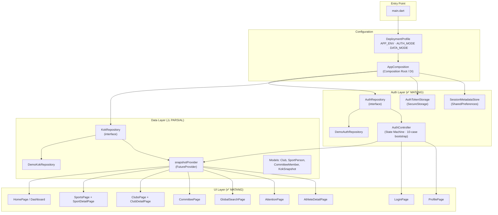
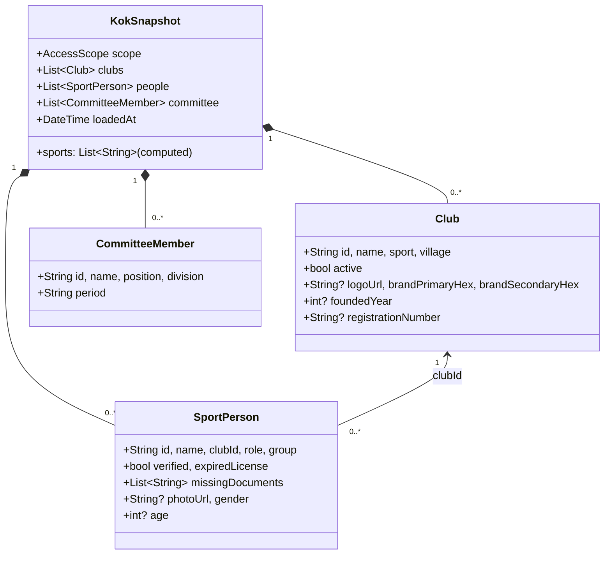

# Audit & Kesiapan Integrasi API — Aplikasi KOK KONI Garut

## Ringkasan Proyek

Aplikasi **KOK (Koordinator Organisasi Kecamatan)** KONI Garut adalah frontend Flutter untuk pemantauan olahraga kecamatan. Versi saat ini (`0.1.0`) adalah prototipe interaktif dengan data demo lokal, belum terhubung SICABOR.

**Stack:** Flutter 3.44.4 / Dart 3.12.2, Riverpod 3, GoRouter 17, Dio 5, Freezed 3, FlutterSecureStorage 9, fl_chart 1.2

---

## Status Proyek Saat Ini

### Arsitektur Keseluruhan



---

### Scorecard Kesiapan per Layer

| Layer | Status | Kesiapan API | Detail |
|:---|:---:|:---:|:---|
| **Auth Domain** (state machine, lifecycle) | ✅ 95% | 🟢 Siap | 10-case bootstrap truth table, mutation queue, generation counter, fail-closed |
| **Auth Storage** (token + metadata) | ✅ 95% | 🟢 Siap | SecureStorage + SharedPrefs, environment-keyed, ownership guard |
| **Auth Repository Interface** | ✅ 100% | 🟢 Siap | `login()`, `restoreSession()`, `refreshToken()`, `revokeSession()` |
| **Deployment Profile** | ✅ 100% | 🟢 Siap | `apiBaseUrl` dan timeout configs tervalidasi untuk mode remote |
| **Composition Root** | ✅ 100% | 🟢 Siap | Remote auth/data adapter terpasang dan fail-closed tanpa kontrak endpoint |
| **Data Models** (Freezed) | ✅ 100% | 🟢 Siap | Field API-ready dan JSON serialization sudah diregenerasi |
| **KokRepository Interface** | ✅ 100% | 🟢 Siap | Snapshot lama dipertahankan dan query granular ditambahkan |
| **Data Providers** (Riverpod) | ✅ 100% | 🟢 Siap | Provider granular memakai session guard, cancellation, dan stale-response guard |
| **Filter/Sort Logic** | ✅ 95% | 🟢 Siap | Multi-criteria filter, 4 sort option — siap pakai |
| **UI Pages** (10 halaman + detail) | ✅ 100% | 🟢 Siap | Field detail, dokumen, helpdesk, dan akun demo sudah dinamis |
| **Permission Enforcement** | ✅ Sesuai keputusan | 🟡 Backend authority | Tab Cabor/Klub/Anggota tetap terbuka; backend wajib menegakkan scope dan permission |
| **HTTP Client** | ✅ 100% fondasi | 🟡 Menunggu kontrak | Dio, Bearer token, refresh 401, timeout, dan taxonomy exception tersedia |

---

## Analisis Detail per Komponen

### 1. Auth Layer — Yang Sudah Sangat Baik ✅

Auth layer ini memiliki kedalaman arsitektur yang **sangat tinggi untuk klien Flutter**:

- **State Machine Formal**: 6 state (`Bootstrapping` → `SignedOut` → `SigningIn` → `SignedIn` → `SigningOut` → `TemporarilyUnavailable`) dengan transisi yang ketat
- **10-Case Bootstrap Truth Table**: Menangani semua kombinasi metadata/credential saat app start (first run, orphan credential, interrupted cleanup, session restore, network timeout, expired token, dll)
- **Serialized Mutation Queue** (`_enqueueMutation`): Eliminasi race condition filesystem/keystore
- **Two-Phase Commit**: Dual storage (SecureStorage + SharedPrefs) dengan rollback jika terganggu
- **Generation Counter**: Mencegah data leak antar sesi — `snapshotProvider` menolak response yang datang setelah user switch account
- **Fail-Closed**: App crash dengan pesan jelas jika dikonfigurasi `remote` tanpa adapter

#### Yang Kurang untuk Produksi Auth:

| Item | Status | Penjelasan |
|:---|:---:|:---|
| Access token di memori untuk HTTP header | ✅ | `AuthSessionTokens` dipakai bersama `AuthController` dan `ApiClient` |
| `UserPrincipal.fromJson()` / `toJson()` | ✅ | Serialization strict untuk response API |
| Conditional demo UI | ✅ | Selector demo hanya pada `AuthMode.demo` |
| `apiBaseUrl` di `DeploymentProfile` | ✅ | URL absolut dan timeout tervalidasi |
| HTTP interceptor (401 + token refresh) | ✅ fondasi | Single-flight refresh tersedia; endpoint auth masih menunggu dokumentasi SICABOR |

---

### 2. Data Layer — Fondasi Bagus, Perlu Diperluas ⚠️

#### Model yang Sudah Ada



#### Masalah Kritis: Snapshot Monolitik

Repository saat ini hanya punya **satu method**:

```dart
abstract interface class KokRepository {
  Future<KokSnapshot> fetchScope(AccessScope scope, {RequestCancellation? cancellation});
}
```

Ini berarti seluruh data (klub, atlet, pelatih, official, pengurus) di-download sekaligus. Untuk produksi:

> [!CAUTION]
> **Bottleneck performa**: Satu kecamatan saja sudah 140 records (5 klub + 125 atlet + 10 pelatih). Skala kabupaten (42 kecamatan) bisa ribuan records per request. Monolitik snapshot tidak akan skalabel.

#### Field Model yang Kurang untuk Fitur UI

| Model | Field yang Kurang | Dipakai Di | Status Sekarang |
|:---|:---|:---|:---|
| `Club` | `phone`, `email`, `address` | AthleteDetailPage (kontak klub) | ✅ Sudah dibaca dari model |
| `Club` | `documents: List<ClubDocument>` | ClubDocumentTab | ✅ Sudah dibaca dari model; empty state bila kosong |
| `SportPerson` | `milestones: List<Milestone>` | AthleteDetailPage (riwayat) | ✅ Sudah dibaca dari model; empty state bila kosong |
| `SportPerson` | `birthDate`, `address`, `nik` | AthleteDetailPage (data detail) | ✅ Field detail utama sudah dinamis |
| `CommitteeMember` | `phone`, `email`, `photoUrl` | CommitteePage (detail sheet) | ✅ Field tersedia pada model dan fixture |
| `KokSnapshot` | `helpdesk: HelpdeskContact` | ProfilePage | ✅ Sudah dibaca dari snapshot; empty state bila kosong |
| `UserPrincipal` | `toJson()` / `fromJson()` | Auth restore, API deserialization | ✅ Serialization strict tersedia |

---

### 3. UI Layer — Visual Matang, Hardcoded Perlu Dibersihkan

#### Halaman-halaman & Status

| Halaman | File | Data Source | Hardcoded Items |
|:---|:---|:---:|:---|
| **Login** | [login_page.dart](file:///f:/Kuliah%20Bullshit/KP/Kerja-Praktik-Koni-KOK/lib/features/login_page.dart) | AuthController | 4 demo accounts (perlu conditional) |
| **Dashboard** | [home_page.dart](file:///f:/Kuliah%20Bullshit/KP/Kerja-Praktik-Koni-KOK/lib/features/home_page.dart) | snapshotProvider ✅ | Fallback text minor |
| **Cabor** | [sports_page.dart](file:///f:/Kuliah%20Bullshit/KP/Kerja-Praktik-Koni-KOK/lib/features/sports_page.dart) | snapshotProvider ✅ | — |
| **Sport Detail** | [sport_detail_page.dart](file:///f:/Kuliah%20Bullshit/KP/Kerja-Praktik-Koni-KOK/lib/features/sport_detail/sport_detail_page.dart) | snapshotProvider ✅ | — |
| **Klub** | [clubs_page.dart](file:///f:/Kuliah%20Bullshit/KP/Kerja-Praktik-Koni-KOK/lib/features/clubs_page.dart) | snapshotProvider ✅ | — |
| **Club Detail** | [club_detail_page.dart](file:///f:/Kuliah%20Bullshit/KP/Kerja-Praktik-Koni-KOK/lib/features/club_detail/club_detail_page.dart) | snapshotProvider ✅ | — |
| **Club Dokumen** | [club_document_tab.dart](file:///f:/Kuliah%20Bullshit/KP/Kerja-Praktik-Koni-KOK/lib/features/club_detail/club_document_tab.dart) | snapshotProvider | Kategori dokumen hardcoded |
| **Profil Atlet** | [athlete_detail_page.dart](file:///f:/Kuliah%20Bullshit/KP/Kerja-Praktik-Koni-KOK/lib/features/athlete_detail/athlete_detail_page.dart) | snapshotProvider | ⚠️ Riwayat, telepon, alamat hardcoded |
| **Anggota** | [committee_page.dart](file:///f:/Kuliah%20Bullshit/KP/Kerja-Praktik-Koni-KOK/lib/features/committee_page.dart) | snapshotProvider ✅ | — |
| **Profil** | [profile_page.dart](file:///f:/Kuliah%20Bullshit/KP/Kerja-Praktik-Koni-KOK/lib/features/profile_page.dart) | snapshotProvider + user | ⚠️ Helpdesk contacts hardcoded |
| **Perhatian** | [attention_page.dart](file:///f:/Kuliah%20Bullshit/KP/Kerja-Praktik-Koni-KOK/lib/features/attention_page.dart) | snapshotProvider ✅ | — |
| **Pencarian** | [global_search_page.dart](file:///f:/Kuliah%20Bullshit/KP/Kerja-Praktik-Koni-KOK/lib/features/search/global_search_page.dart) | snapshotProvider ✅ | — |

---

### 4. Permission System — Scope UI Sesuai Keputusan, Authority Tetap di Backend 🟡

Permissions yang didefinisikan vs ditegakkan:

| Permission | Didefinisikan | Ditegakkan di UI | Dimana |
|:---|:---:|:---:|:---|
| `reports:export` | ✅ | ✅ | ProfilePage (rekap), SportDetailPage (salin) |
| `sports:read` | ✅ | ❌ | Tidak dicek — semua user bisa akses tab Cabor |
| `clubs:read` | ✅ | ❌ | Tidak dicek — semua user bisa akses tab Klub |
| `members:read` | ✅ | ❌ | Tidak dicek — semua user bisa akses tab Anggota |
| `documents:verify` | ✅ | ❌ | Tidak dicek di manapun |

> [!IMPORTANT]
> **Keputusan desain:** tab Cabor, Klub, dan Anggota tetap dapat dibuka oleh user terautentikasi karena aplikasi hanya dipakai koordinator kecamatan. Data yang ditampilkan mengikuti scope kecamatan pada sesi tersebut. Ini hanya keputusan keterjangkauan UI; backend SICABOR tetap wajib memeriksa permission dan scope pada setiap request.

---

## Proposed Changes — Kesiapan Integrasi API

### Pendekatan yang Direkomendasikan

> [!IMPORTANT]
> **Strategi**: Mempersiapkan semua lapisan agar "tinggal colok" ke API tanpa mengubah UI. Artinya:
> 1. Memperluas model data agar mencakup semua field yang dibutuhkan UI
> 2. Memperkaya demo data agar mencerminkan response API nyata
> 3. Memecah repository contract menjadi granular (per-resource)
> 4. Menyiapkan HTTP client infrastructure
> 5. Membersihkan hardcoded mock dari UI

### Fase 1: Perluas Data Models & Demo Data

#### [MODIFY] [models.dart](file:///f:/Kuliah%20Bullshit/KP/Kerja-Praktik-Koni-KOK/lib/data/models.dart)

Tambah field ke model eksisting:

```dart
// Club — tambah kontak & dokumen
@freezed
abstract class Club with _$Club {
  const factory Club({
    // ... existing fields ...
    String? phone,
    String? email,
    String? address,
    @Default(<ClubDocument>[]) List<ClubDocument> documents,
  }) = _Club;
}

@freezed
abstract class ClubDocument with _$ClubDocument {
  const factory ClubDocument({
    required String id,
    required String name,        // 'SK Klub', 'Kepengurusan', dll
    required String status,      // 'verified', 'pending', 'missing'
    String? fileUrl,
    DateTime? uploadedAt,
    DateTime? verifiedAt,
  }) = _ClubDocument;
}

// SportPerson — tambah detail profil & riwayat
@freezed
abstract class SportPerson with _$SportPerson {
  const factory SportPerson({
    // ... existing fields ...
    String? nik,
    String? birthPlace,
    DateTime? birthDate,
    String? address,
    @Default(<Milestone>[]) List<Milestone> milestones,
    @Default(<String>[]) List<String> requiredDocuments,
    @Default(<String>[]) List<String> completedDocuments,
  }) = _SportPerson;
}

@freezed
abstract class Milestone with _$Milestone {
  const factory Milestone({
    required String year,
    required String title,
    String? description,
  }) = _Milestone;
}

// CommitteeMember — tambah kontak
@freezed
abstract class CommitteeMember with _$CommitteeMember {
  const factory CommitteeMember({
    // ... existing fields ...
    String? phone,
    String? email,
    String? photoUrl,
  }) = _CommitteeMember;
}

// KokSnapshot — tambah helpdesk
@freezed
abstract class KokSnapshot with _$KokSnapshot {
  const factory KokSnapshot({
    // ... existing fields ...
    HelpdeskContact? helpdesk,
  }) = _KokSnapshot;
}

@freezed
abstract class HelpdeskContact with _$HelpdeskContact {
  const factory HelpdeskContact({
    String? whatsapp,
    String? phone,
    String? email,
    String? address,
    String? operationalHours,
  }) = _HelpdeskContact;
}
```

#### [MODIFY] [demo_kok_repository.dart](file:///f:/Kuliah%20Bullshit/KP/Kerja-Praktik-Koni-KOK/lib/data/demo_kok_repository.dart)

Perkaya demo data dengan field baru:
- Tambah `phone`, `address`, `documents` ke setiap Club
- Tambah `milestones`, `birthDate`, `address` ke beberapa SportPerson
- Tambah `phone`, `email` ke CommitteeMember
- Tambah `helpdesk` ke KokSnapshot

---

### Fase 2: Pecah Repository Contract

#### [MODIFY] [kok_repository.dart](file:///f:/Kuliah%20Bullshit/KP/Kerja-Praktik-Koni-KOK/lib/data/kok_repository.dart)

```dart
abstract interface class KokRepository {
  // Existing — tetap dipertahankan untuk dashboard summary
  Future<KokSnapshot> fetchScope(AccessScope scope, {RequestCancellation? cancellation});

  // Granular queries — baru
  Future<List<Club>> fetchClubs(AccessScope scope, {String? sport, String? query, RequestCancellation? cancellation});
  Future<Club> fetchClubDetail(String clubId, {RequestCancellation? cancellation});
  Future<List<SportPerson>> fetchClubMembers(String clubId, {String? role, RequestCancellation? cancellation});
  Future<SportPerson> fetchPersonDetail(String personId, {RequestCancellation? cancellation});
  Future<List<CommitteeMember>> fetchCommittee(AccessScope scope, {RequestCancellation? cancellation});
  Future<HelpdeskContact?> fetchHelpdesk({RequestCancellation? cancellation});
}
```

#### [MODIFY] [demo_kok_repository.dart](file:///f:/Kuliah%20Bullshit/KP/Kerja-Praktik-Koni-KOK/lib/data/demo_kok_repository.dart)

Implementasikan semua method baru dengan filter dari data demo yang sudah ada.

---

### Fase 3: Tambah Granular Providers

#### [NEW] [providers/club_providers.dart](file:///f:/Kuliah%20Bullshit/KP/Kerja-Praktik-Koni-KOK/lib/data/providers/club_providers.dart)

Provider-provider granular yang bisa dipakai oleh halaman detail tanpa harus fetch seluruh snapshot:

```dart
// Club detail provider — fetch single club
final clubDetailProvider = FutureProvider.family<Club, String>((ref, clubId) async { ... });

// Club members provider — fetch members per role
final clubMembersProvider = FutureProvider.family<List<SportPerson>, ({String clubId, String? role})>((ref, params) async { ... });

// Person detail provider — fetch single person
final personDetailProvider = FutureProvider.family<SportPerson, String>((ref, personId) async { ... });

// Committee provider
final committeeProvider = FutureProvider<List<CommitteeMember>>((ref) async { ... });
```

---

### Fase 4: HTTP Client & Auth Interceptor

#### [NEW] [core/network/api_client.dart](file:///f:/Kuliah%20Bullshit/KP/Kerja-Praktik-Koni-KOK/lib/core/network/api_client.dart)

Konfigurasi Dio client dengan base URL, timeouts, dan auth interceptor:

```dart
class ApiClient {
  final Dio dio;
  final AuthTokenStorage tokenStorage;
  final AuthController authController;

  // Auto-inject Bearer token
  // Auto-refresh on 401
  // Map DioException → domain exceptions
}
```

#### [MODIFY] [core/config/deployment_profile.dart](file:///f:/Kuliah%20Bullshit/KP/Kerja-Praktik-Koni-KOK/lib/core/config/deployment_profile.dart)

Tambah network configuration:

```dart
final class DeploymentProfile {
  // ... existing ...
  final String apiBaseUrl;
  final Duration connectTimeout;
  final Duration receiveTimeout;
}
```

#### [MODIFY] [core/auth/presentation/auth_controller.dart](file:///f:/Kuliah%20Bullshit/KP/Kerja-Praktik-Koni-KOK/lib/core/auth/presentation/auth_controller.dart)

Expose `accessToken` agar bisa digunakan HTTP interceptor:

```dart
final class AuthSignedIn extends AuthState {
  final UserPrincipal user;
  final int generation;
  final String? accessToken;  // ← BARU: untuk HTTP Authorization header
}
```

#### [NEW] [core/auth/data/remote_auth_repository.dart](file:///f:/Kuliah%20Bullshit/KP/Kerja-Praktik-Koni-KOK/lib/core/auth/data/remote_auth_repository.dart)

Placeholder implementasi `AuthRepository` dengan Dio (stub yang throw `UnimplementedError` sampai endpoint tersedia).

#### [NEW] [data/remote_kok_repository.dart](file:///f:/Kuliah%20Bullshit/KP/Kerja-Praktik-Koni-KOK/lib/data/remote_kok_repository.dart)

Placeholder implementasi `KokRepository` dengan Dio.

---

### Fase 5: Bersihkan Hardcoded Mock dari UI

#### [MODIFY] [features/login_page.dart](file:///f:/Kuliah%20Bullshit/KP/Kerja-Praktik-Koni-KOK/lib/features/login_page.dart)

Conditional demo accounts: hanya tampil jika `profile.authMode == AuthMode.demo`.

#### [MODIFY] [features/athlete_detail/athlete_detail_page.dart](file:///f:/Kuliah%20Bullshit/KP/Kerja-Praktik-Koni-KOK/lib/features/athlete_detail/athlete_detail_page.dart)

- Riwayat → ambil dari `person.milestones` (bukan hardcoded)
- Kontak klub → ambil dari `club.phone` (bukan hardcoded `'0812-3456-7890'`)
- Detail lahir/alamat → ambil dari field model baru

#### [MODIFY] [features/club_detail/club_document_tab.dart](file:///f:/Kuliah%20Bullshit/KP/Kerja-Praktik-Koni-KOK/lib/features/club_detail/club_document_tab.dart)

Dokumen → ambil dari `club.documents` (bukan hardcoded 'SK Klub', 'Kepengurusan').

#### [MODIFY] [features/profile_page.dart](file:///f:/Kuliah%20Bullshit/KP/Kerja-Praktik-Koni-KOK/lib/features/profile_page.dart)

Helpdesk kontak → ambil dari `snapshot.helpdesk` (bukan hardcoded demo contacts).

#### [MODIFY] [core/auth/domain/user_principal.dart](file:///f:/Kuliah%20Bullshit/KP/Kerja-Praktik-Koni-KOK/lib/core/auth/domain/user_principal.dart)

Tambah `UserPrincipal.fromJson()` dan `toJson()` untuk deserialization dari response API.

---

### Fase 6: Error Handling & Exception Taxonomy

#### [NEW] [core/network/api_exceptions.dart](file:///f:/Kuliah%20Bullshit/KP/Kerja-Praktik-Koni-KOK/lib/core/network/api_exceptions.dart)

```dart
sealed class ApiException implements Exception { ... }
class UnauthorizedException extends ApiException { ... }
class ForbiddenException extends ApiException { ... }
class NotFoundException extends ApiException { ... }
class NetworkOfflineException extends ApiException { ... }
class ServerErrorException extends ApiException { ... }
class TimeoutException extends ApiException { ... }
```

---

## Keputusan Open Questions dan Dampak Implementasi

### Q1 — Dokumentasi endpoint SICABOR

**Jawaban:** belum ada. Tim belum memberikan dokumentasi endpoint sama sekali.

**Dampak:** kontrak internal repository dan DTO UI sudah disiapkan, tetapi adapter remote tidak menebak URL, method, payload, envelope, pagination, field, atau status response. `RemoteAuthRepository` dan `RemoteKokRepository` fail-closed sampai dokumentasi resmi diterima.

### Q2 — Visibilitas tab Cabor, Klub, dan Anggota

**Jawaban:** tab seharusnya bisa dibuka. Aplikasi hanya dipakai koordinator kecamatan dan data hanya ditampilkan sesuai data kecamatan tersebut.

**Dampak:** tidak ada route guard, hide, atau disable baru untuk ketiga tab. Scope sesi diteruskan ke repository/provider; otorisasi lintas kecamatan tetap menjadi kewenangan backend.

### Q3 — Offline-first

**Jawaban:** offline-first belum didiskusikan kembali oleh tim.

**Dampak:** belum menambahkan SQLite/Drift/Hive atau cache data domain. SharedPreferences tetap hanya digunakan untuk preferensi dan metadata sesi yang sudah ada. Keputusan caching dapat dibuat sebagai fase terpisah setelah kebutuhan operasional dan retensi data disepakati.

### Q4 — Scope dan prioritas

**Jawaban:** semua fase diimplementasikan agar rapih dan terstruktur.

**Dampak:** Fase 1–6 sudah diimplementasikan sebagai fondasi API-ready. Fase networking berhenti pada boundary adapter fail-closed karena Q1 belum terpenuhi; pekerjaan yang tersisa adalah mapping endpoint resmi, bukan menebak kontrak.

### Status implementasi per fase

| Fase | Hasil |
|:---|:---|
| 1. Model & fixture | Field detail API-ready, Freezed/JSON regenerated, fixture demo diperkaya tanpa mengubah scope/count utama |
| 2. Repository granular | Query klub, detail klub, anggota per role, detail anggota, committee per scope, helpdesk, cancellation, not-found, dan scope guard |
| 3. Provider granular | Provider Riverpod untuk detail/anggota/committee/helpdesk dengan session generation dan cancellation guard |
| 4. HTTP & auth | Access token in-memory, configuration URL/timeout, Dio client, Bearer injection, single-flight refresh, dan exception mapping |
| 5. UI cleanup | Akun demo conditional, detail atlet/dokumen klub/helpdesk dinamis, empty state, tab tetap tersedia |
| 6. Error handling & composition | Taxonomy exception serta adapter remote fail-closed tersusun di composition root |

Implementasi tidak mengklaim aplikasi sudah terhubung SICABOR. Aktivasi remote nyata menunggu dokumentasi endpoint, kredensial lingkungan, aturan pagination/filter, dan kontrak akses dokumen.

---

## Verification Plan

### Automated Tests
```powershell
flutter pub run build_runner build --delete-conflicting-outputs
dart format lib test
flutter analyze
flutter test
flutter build web
```

Verifikasi implementasi 2026-09-12 juga mencakup test terfokus untuk model/auth (18/18), repository (10/10), provider (2/2), auth regression (88/88), API client/profile (19/19), adapter remote (17/17), dan UI terfokus (53/53). Angka tersebut adalah checkpoint selama implementasi; jalankan suite penuh pada environment lokal sebelum rilis.

### Manual Verification
- Login dengan 3 akun demo → verifikasi semua field baru tampil di UI
- Navigasi ke setiap halaman → pastikan tidak ada hardcoded mock tersisa
- Test pull-to-refresh → pastikan granular providers bekerja
- Build APK debug → pastikan tidak ada runtime error

---

## Kesimpulan

Proyek ini sudah **sangat maju** dari segi arsitektur. Auth layer khususnya memiliki kedalaman yang luar biasa (mutation queue, truth table bootstrap, generation counter). Yang perlu dibenahi untuk kesiapan API:

1. 🟢 **Model data diperluas** — field yang dibutuhkan UI sudah masuk model dan serialisasi
2. 🟢 **Repository granular tersedia** — snapshot lama dipertahankan sebagai summary, query detail siap dipakai
3. 🟡 **HTTP infrastructure siap sebagai fondasi** — endpoint remote masih menunggu dokumentasi SICABOR
4. 🟢 **UI dibersihkan** — hardcoded domain mock diganti model dan empty state
5. 🟢 **Auth bridge siap** — access token in-memory dan adapter remote fail-closed tersedia
