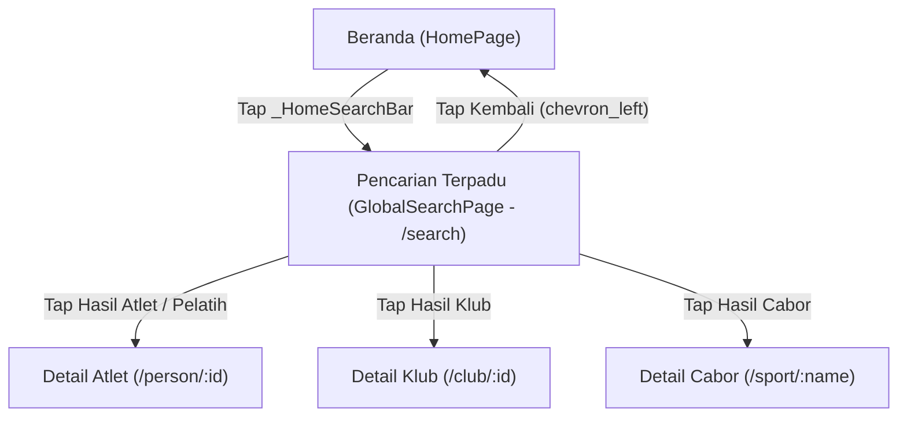

# Spesifikasi Desain: Modul Pencarian Terpadu (Global Search) & Integrasi Search Bar Beranda

Tanggal: 2026-09-07  
Status: Approved  

---

## 1. Latar Belakang & Masalah
Saat ini, pencarian atlet, pelatih, maupun official hanya dapat dilakukan secara bertingkat dan terkunci di dalam sub-tab Detail Klub (`/club/:id`). Pengguna yang ingin mencari nama atlet tertentu harus mengetahui nama klub terlebih dahulu, masuk ke halaman Klub, membuka detail klub, memilih tab Atlet, baru dapat melakukan pencarian. 

Kebutuhan utama pengguna (khususnya Koordinator KOK Kecamatan Garut Kota) adalah dapat mencari atlet, pelatih, klub, atau cabang olahraga secara cepat dan langsung begitu aplikasi dibuka tanpa harus melalui alur navigasi bertingkat.

---

## 2. Sasaran & Batasan Desain

### Sasaran (Goals)
1. **Pencarian Seketika dari Beranda**: Pengguna dapat mengetuk search bar di Beranda dan langsung mencari entitas apapun se-Kecamatan Garut Kota.
2. **Multi-Entitas Terpadu**: Mendukung pencarian atlet, pelatih, official, klub, dan cabang olahraga dalam satu kolom pencarian dengan filter kategori.
3. **Navigasi Langsung**: Mengetuk hasil pencarian langsung mengarahkan ke halaman detail yang relevan (`/person/:id`, `/club/:id`, `/sport/:name`).
4. **Layout Harmonis Tanpa Benturan**: Pemasangan search bar di header Beranda tidak merusak overlapping card statistik (`_FloatingStatsCard`), mempertahankan jarak visual aman setinggi 16px.
5. **Konsistensi Visual & Tema**: Menggunakan tombol kembali standar `Icons.chevron_left` (size: 28), warna judul kartu `KokColors.cardTitle` (`#141414`), dan palet warna resmi wireframe slide 10.

### Batasan (Constraints)
- Tidak mengubah struktur 5 tab navigasi bawah (`Beranda`, `Cabor`, `Klub`, `Anggota`, `Akun`).
- Avatar "PA" di pojok kanan atas header Beranda tetap dipertahankan.
- Performa pencarian instan lokal dari snapshot data yang sudah ter-cache (`snapshotProvider`).

---

## 3. Arsitektur Komponen & Navigasi



### A. Integrasi di `HomePage` (`lib/features/home_page.dart`)
- **Struktur Header**:
  - Di dalam `DashboardHeaderDecoration`, konten header diubah menjadi `Column(crossAxisAlignment: CrossAxisAlignment.stretch, mainAxisSize: MainAxisSize.min)`.
  - Baris 1: Logo KONI Garut, identitas wilayah & salam Pak Asep, serta avatar `PA` (dipertahankan).
  - Jarak pemisah vertikal: `14px`.
  - Baris 2: `_HomeSearchBar` ber-radius `14px`, tinggi `46px`, warna putih dengan drop shadow halus (`alpha: 0.08`, blur `10px`).
    - Ikon `Icons.search` warna `KokColors.muted`.
    - Placeholder teks: `"Cari nama atlet, klub, cabor..."`.
    - Chip aksi `"Cari"` di sisi kanan berwarna `KokColors.bluePrimary` dengan latar `KokColors.pale`.
- **Kalkulasi Overlap**:
  - Padding bawah `DashboardHeaderDecoration` diatur `48px`.
  - `_FloatingStatsCard` ditarik ke atas dengan `Transform.translate(offset: Offset(0, -32))`.
  - Ruang bebas antara bagian bawah search bar dan bagian atas floating card adalah `48 - 32 = 16px`, sehingga tidak terjadi tabrakan atau tumpang tindih elemen.

### B. Pendaftaran Rute (`lib/app.dart`)
- Menambahkan rute `/search`:
  ```dart
  GoRoute(
    path: '/search',
    builder: (_, _) => const GlobalSearchPage(),
  ),
  ```

### C. Modul Baru `GlobalSearchPage` (`lib/features/search/global_search_page.dart`)
1. **AppBar & Input**:
   - `leading`: `IconButton(icon: Icon(Icons.chevron_left, size: 28, color: KokColors.cardTitle))` untuk kembali (`context.pop()`).
   - `title`: `TextField` dengan `autofocus: true`, `textInputAction: TextInputAction.search`, dekorasi tanpa garis batas berat, prefix `Icon(Icons.search)`, suffix `IconButton(Icons.close)` jika query tidak kosong.
   - Placeholder: `"Cari nama atlet, pelatih, klub, cabor..."`.
2. **Filter Chips Bar**:
   - Pilihan: `Semua` (default), `Atlet`, `Pelatih`, `Klub`, `Cabor`.
   - Latar chip aktif `KokColors.bluePrimary` dengan teks putih; chip pasif berlatar putih dengan border `KokColors.borderGray` dan teks `KokColors.textSecondary`.
3. **Logika Pencarian Multi-Entitas**:
   - **Atlet & Pelatih (`SportPerson`)**:
     - Pencocokan teks (case-insensitive) pada: `person.name`, `club.name`, `club.sport`, `person.group`.
     - Filter berdasarkan role jika chip `Atlet` atau `Pelatih` aktif.
   - **Klub (`Club`)**:
     - Pencocokan teks pada: `club.name`, `club.sport`, `club.village`.
     - Aktif jika chip `Semua` atau `Klub` dipilih.
   - **Cabor (`String`)**:
     - Pencocokan teks pada nama olahraga unik dari `data.clubs.map((c) => c.sport)`.
     - Aktif jika chip `Semua` atau `Cabor` dipilih.
4. **Kartu Hasil Pencarian**:
   - **Kartu Personil (Atlet / Pelatih)**:
     - Avatar bulat dengan inisial atau foto, warna aksen klub.
     - Nama personil tebal (`KokColors.cardTitle`, 15sp).
     - Badge role: `Atlet` (latar hijau lembut `#D1FAE5`, teks hijau `#059669`) atau `Pelatih` (latar biru lembut `#E0E7FF`, teks `#3730A3`).
     - Subtitle: `[Nama Klub] · [Cabor] · [Kelompok Umur]`.
     - Tapping: `context.push('/person/${person.id}')`.
   - **Kartu Klub**:
     - Logo klub atau avatar cabor, nama klub tebal (`KokColors.cardTitle`, 15sp).
     - Subtitle: `[Cabor] · [Desa/Kelurahan] · [Jumlah Atlet] atlet`.
     - Tapping: `context.push('/club/${club.id}')`.
   - **Kartu Cabor**:
     - Ikon cabor `sportIcon(sport)`, nama cabor tebal (`KokColors.cardTitle`, 15sp).
     - Subtitle: `[Jumlah Klub] klub · [Jumlah Atlet] atlet`.
     - Tapping: `context.push('/sport/${Uri.encodeComponent(sport)}')`.
5. **State Tampilan**:
   - **Initial State (Query Kosong)**:
     - Teks panduan: *"Ketik nama atlet, pelatih, klub, atau cabor se-Kecamatan Garut Kota"*.
     - Rekomendasi Cabor Populer (chips yang dapat diklik untuk mengisi query secara instan).
   - **Empty State (Hasil Tidak Ditemukan)**:
     - Ikon pencarian kosong, teks: *"Tidak ditemukan hasil untuk \"<query>\" pada kategori <kategori>"*.

---

## 4. Rencana Pengujian (Testing & Verification)

1. **Unit & Widget Test (`test/search_page_test.dart`)**:
   - Render AppBar dengan autofocus input dan filter chips.
   - Pencarian atlet: mengetik nama atlet memunculkan kartu hasil yang relevan.
   - Filter chip switching: memilih chip "Atlet" hanya memfilter atlet dan menyembunyikan klub/cabor.
   - Navigasi: mengetuk kartu hasil mengarahkan ke rute detail yang tepat (`/person/:id`, `/club/:id`, `/sport/:name`).
   - Clear button: mengetuk tombol silang mengosongkan query.
   - Empty state: menampilkan pesan tidak ditemukan saat memasukkan kata kunci acak.
2. **Integration Test (`test/app_test.dart`)**:
   - Verifikasi alur dari Beranda mengetuk `_HomeSearchBar` $\rightarrow$ membuka `/search` $\rightarrow$ mencari atlet $\rightarrow$ navigasi ke Detail Atlet $\rightarrow$ kembali ke Beranda.
3. **Golden Previews (`test/preview_test.dart`)**:
   - Menambahkan preview mobile `previews/pencarian.png`.
4. **Analisis Statis**:
   - `flutter analyze` dengan 0 issues.
